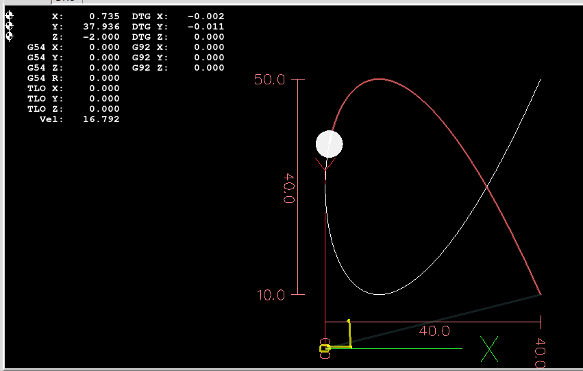
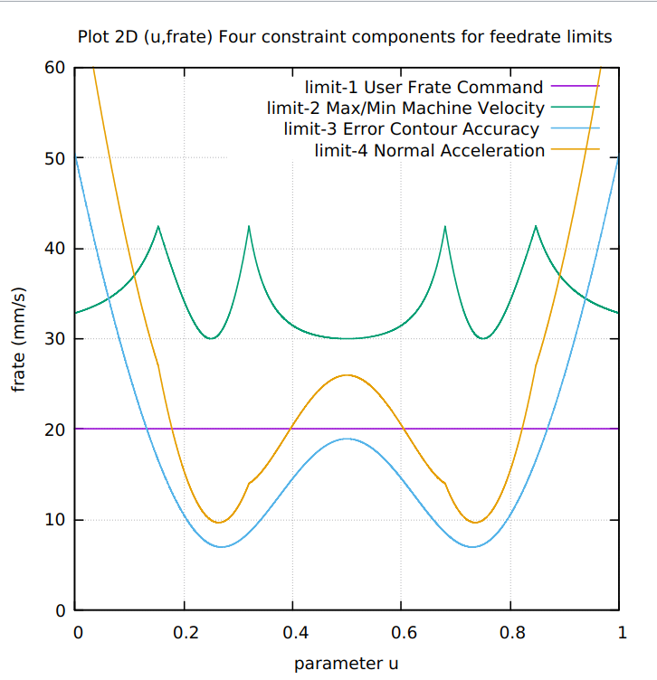
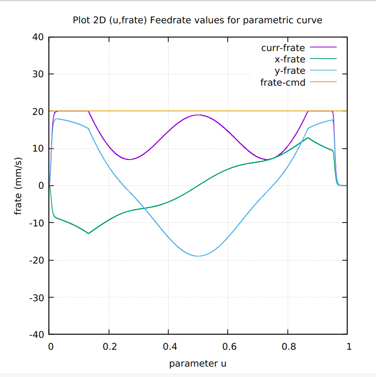

# RIBBON-100L-parametric-curve
RIBBON-100L C-codes to generate NGC for CNC milling. This is a 10 times scaleup of RIBBON-10L.

# The four(4) contributions to the Feedrate Limit

# Current feedrate = minimum of feedrate limits

# Feedrate execution profile videos for (FC10, FC20, FC25, FC30, and FC40)

Display of different feedrate profile every 5 seconds. 
See the transitions in titles for the plots accordingly. 
https://github.com/wruslancnc/RIBBON-100L-parametric-curve/blob/main/RIBBON100L-videos/10-RIBBON-100L-Feedrate-Profile.mp4

Wassalam.
WRY

