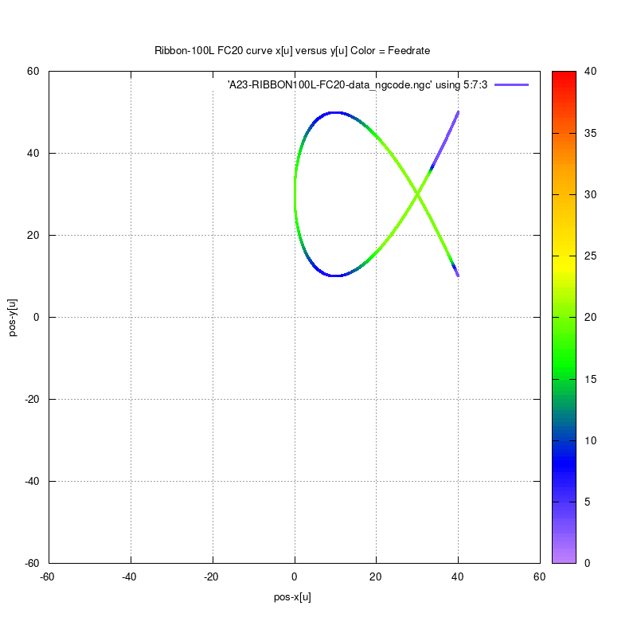
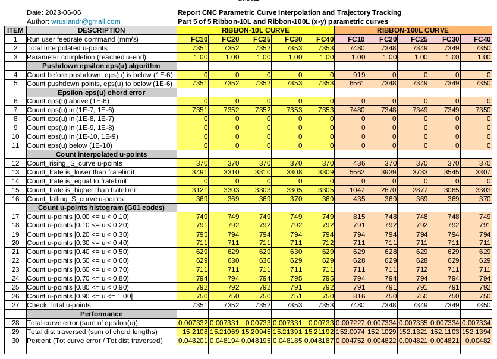

# RIBBON-100L-parametric-curve
RIBBON-100L C-codes to generate NGC for CNC milling. This is a 10 times scaleup of RIBBON-10L.

# The four(4) contributions to the Feedrate Limit

# Current feedrate = minimum of feedrate limits

# Feedrate run profile for command feedrate = FC20

# Run data for command feedrates (FC10,FC20,FC25,FC30,FC40)

Wassalam.
WRY

